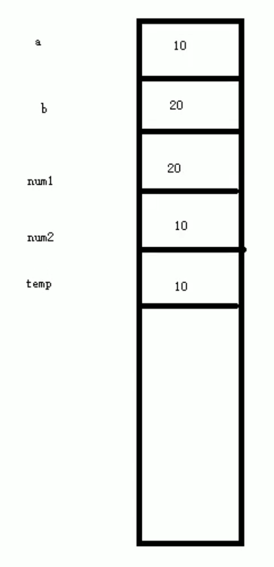

# C++的函数

# 1. 函数

## 1.1 函数概述

① 函数作用：将一段经常使用的代码封装起来，减少重复代码。

② 一个较大的程序，一般分为若干个程序块，每个模块实现特定的功能。

## 1.2 函数定义

① 函数的定义主要有5个部分：

1. 返回值类型：一个函数可以返回一个值。
2. 函数名：给函数起个名称。
3. 参数列表：使用该函数时，传入的数据。
4. 函数体语句：花括号内的代码，函数内需要执行的语句。
5. return表达式：和返回值类型挂钩，函数执行完后，返回相应的数据。

② 语法格式如下所示：


```python
返回值类型 函数名 (参数列表)
{
     函数体语句

     return 表达式
}
```


```python
#include <iostream>
using namespace std;

//函数的定义
//语法：返回值类型 函数名 (参数列表) { 函数体语句 return表达式 }

//加法函数，实现两个整型相加，并且将相加的结果进行返回
int add(int num1, int num2)
{
    int sum = num1 + num2;
    return sum;
}

int main()
{

    system("pause");   //按任意键继续

    return 0;

}
```

## 1.3 函数调用

① 功能：使用定义好的函数

② 语法：函数名(参数)

③ 函数定义里小括号内称为形参，函数调用时传入的参数称为实参


```python
#include <iostream>
using namespace std;

//函数的定义
//语法:
//返回值类型 函数名 (参数列表) { 函数体语句 return表达式 }

//定义加法函数
//函数定义的时候，num1和num2并不是真实数据
//它们只是一个形式上的参数，简称形参
int add(int num1, int num2)
{
    int sum = num1 + num2;
    return sum;
}

int main()
{
    //main函数中调用add函数
    int a = 10;
    int b = 20;

    //函数调用语法：函数名称：（参数）
    //a和b称为 实际参数，简称实参
    //当调用函数的时候，实参的值会传递给形参
    int c = add(a, b);

    cout << "c = " << c << endl;

    system("pause");   //按任意键继续

    return 0;

}
```

运行结果：
 - c = 30
 - 请按任意键继续. . .

## 1.4 函数值传递

① 所谓值传递，就是函数调用时实参将数值传入给形参。

② 值传递时，如果形参发生改变，并不影响实参。

③ 在下面代码例子中，实参传进去时，新参会产生新的内存空间赋值，对num1、num2的操作并不会改变实参a、b的值。




```python
#include <iostream>
using namespace std;

//值传递
//定义函数，实现两个数字进行交换函数

//如果函数不需要返回值，声明的时候可以写void
void swap(int num1, int num2)
{
    cout << "交换前：" << endl;
    cout << "num1= " << num1 << endl;
    cout << "num2= " << num2 << endl;

    int temp = num1;
    num1 = num2;
    num2 = temp;

    cout << "交换后：" << endl;
    cout << "num1= " << num1 << endl;
    cout << "num2= " << num2 << endl;

    return;  //前面写了void，所以不需要返回值。返回值不需要的时候，也可以不写return。
}


int main()
{
    //main函数中调用add函数
    int a = 10;
    int b = 20;

    cout << "a = " << a << endl;
    cout << "b = " << b << endl;

    //当我们把值传递的时候，函数的形参发生发生改变，并不会影响实参
    swap(a, b);
    cout << "a = " << a << endl;
    cout << "b = " << b << endl;

    system("pause");   //按任意键继续

    return 0;

}
```

运行结果：  
 - a = 10  
 - b = 20  
 - 交换前：  
 - num1= 10  
 - num2= 20  
 - 交换后：  
 - num1= 20  
 - num2= 10  
 - a = 10  
 - b = 20

## 1.5 函数常见样式

① 常见的函数样式有四种

1. 无参无返
2. 有参无返
3. 无参有返
4. 有参有返


```python
#include <iostream>
using namespace std;

//函数常见样式
//1、无参无返
void test01()
{
    cout << "this is test01" << endl;
}

//2、有参无返
void test02(int a)
{
    cout << "this is test 02 a = " << a << endl;
}

//3、无参有返
int test03()
{
    cout << "this is test 03 " << endl;

    return 1000;
}

//4、有参有返
int test04(int a )
{
    cout << "this is test 04 a = " << a << endl;

    return a;
}

int main()
{
    //无参无返函数调用
    test01();

    //有参无返函数调用
    test02(100);

    //无参有返函数调用
    int num1 = test03();
    cout << "num1 = " << num1 << endl;

    //有参有返函数调用
    int num2 = test04(10000);
    cout << "num2 = " << num2 << endl;

    system("pause");   //按任意键继续

    return 0;

}
```

运行结果：  
 - this is test01  
 - this is test 02 a = 100  
 - this is test 03  
 - num1 = 1000  
 - this is test 04 a = 10000  
 - num2 = 10000

## 1.6 函数声明

① 作用：告诉编译器函数名称及如何调用函数。函数的实际主体可以单独定义。

② 函数的声明可以多次，但是函数的定义只能有一次。


```python
#include <iostream>
using namespace std;

//函数的声明
//比较函数，实现两个整型数字进行比较，返回较大的值。

//提前告诉编译器函数的存在，可以利用函数的声明
//函数的声明
//声明可以写多次，但是定义只能有一次
int max(int a, int b);
int max(int a, int b);
int max(int a, int b);

int main()
{
    int a = 10;
    int b = 20;
    cout << max(a, b) << endl;

    system("pause");   //按任意键继续

    return 0;

}

//函数定义在main函数之后，必须要在main函数之前写函数的声明
int max(int a, int b)
{
    return a > b ? a : b;
}
```

运行结果：  
 - 20

## 1.7 函数分文件编写

① 作用：让代码结构更加清晰。

② 函数分文件编写一般有4个步骤：

1. 创建后缀名为.h的头文件。
2. 创建后缀名为.cpp的源文件。
3. 在头文件中写函数的声明。
4. 在源文件中写函数的定义。

### 1.7.1 swap.h头文件


```python
//这个是swap.h头文件

#include <iostream>
using namespace std;

//函数的声明
void swap(int a, int b);
```

### 1.7.2 swap.pp源文件


```python
//这个是swap.pp源文件

#include "swap.h"

//函数的定义
void swap(int a, int b)
{
    int temp = a;
    a = b;
    b = temp;

    cout << "a = " << a << endl;
    cout << "b = " << b << endl;

}
```

### 1.7.3 主文件 .cpp文件


```python
//主文件，调用函数分文件

#include <iostream>
using namespace std;
#include "swap.h"  //包含要调用的函数的头文件，双引号表示我们自己写的头文件

int main()
{
    int a = 10;
    int b = 20;
    cout << max(a, b) << endl;
    
    system("pause");   //按任意键继续

    return 0;

}
```

## 1.8 函数默认参数

① 在C++中，函数的形参列表中的形参是可以有默认值的。

② 语法：返回值类型 函数名 (参数 = 默认值) {}


```python
#include <iostream>
using namespace std;

//函数默认参数

//如果我们自己传入数据，就用自己的数据，如果没有，那么永默认值
//语法：返回值类型 函数名（形参 = 默认值）
int func01(int a,int b,int c)
{
    return a + b + c;
}
//注意事项
//1、如果某个位置以及有了默认参数，那么从这个位置往后，从左到右都必须有默认值
int func02(int a, int b = 40, int c = 50)
{
    return a + b + c;
}

//2、如果函数声明有默认参数，函数实现就不能有默认参数
//例如，函数定义为 int func03(int a = 20, int b = 20){return a + b;}，而函数声明为int func03(int a = 10, int b = 10);那么编译器不知道按照哪个默认参数来运行                                 
//声明和实现只能有一个有默认参数
int func03(int a = 10, int b = 10);

//这个是函数的实现
int func03(int a , int b) 
{  
    return a + b;
}

int main()
{
    cout << func01(10, 20, 30) << endl;
    cout << func02(10) << endl;
    cout << func02(10, 20) << endl;
    cout << func02(10, 20,30) << endl;

    cout << func03() << endl;

    system("pause");

    return 0;

}
```

运行结果：  
 - 60  
 - 100  
 - 80  
 - 60  
 - 20  
 - 请按任意键继续. . .

## 1.9 函数占位参数

① C++中函数的形参列表里可以有占位参数，用来做占位，调用函数时必须填补该位置。

② 语法：返回值类型 函数名 （数据类型） {}


```python
#include <iostream>
using namespace std;

//占位参数
//返回值类型 函数名(数据类型){}

//目前，占位参数还用不到，后面会用到
void func01(int a,int)
{
    cout << "this is func01" << endl;  //函数内部无法调用第二个参数，无法像a+b这样调用第二个参数                  
}

//占位参数，还可以有默认参数
void func02(int a, int = 10)
{
    cout << "this is func02" << endl;  
}

int main()
{
    
    func01(10, 20);
    func02(10);  //有默认参数，可以只输入一个参数

    system("pause");

    return 0;

}
```

运行结果：  
 - this is func01  
 - this is func02  
 - 请按任意键继续. . .

# 2. 函数重载

## 2.1 函数重载条件

① 作用：函数名可以相同，提高复用性。

② 函数重载满足条件：

1. 同一个作用域下。
2. 函数名称相同。
3. 函数参数类型不同 或者 个数不同 或者 顺序不同。

③ 函数的返回值不可以作为函数重载的条件。


```python
#include <iostream>
using namespace std;

//函数重载
//可以让函数名相同，提高复用性

//函数重载的满足条件
//1、同一作用域下
//2、函数名称相同
//3、函数参数类型不同，或者个数不同，或者顺序不同
void func()
{
    cout << "func 的调用" << endl;
}

void func(int a)
{
    cout << "func (int a) 的调用" << endl;
}

void func(double a)
{
    cout << "func (double a) 的调用" << endl;
}

void func(double a, int b)
{
    cout << "func (double a, int b) 的调用" << endl;
}

void func(int a, double b)
{
    cout << "func (int a, double b) 的调用" << endl;
}

/*
注意事项
函数的返回值不可以作为函数重载的条件
int func(int a, double b)   
//调用func(3.14,3)时，编译器不知道是调用int func(int a, double b){}还是调用void func(int a, double b){}                       
{
    cout << "func (int a, double b) 的调用" << endl;
}
*/

int main()
{
    
    func();  // 根据传入参数的个数不同，调用不同的函数
    func(10);

    func(3.14); // 根据传入参数的类型不同，调用不同的函数

    func(3,3.14); // 根据传入参数的顺序不同，调用不同的函数
    func(3.14,3); // 根据传入参数的顺序不同，调用不同的函数
    system("pause");

    return 0;

}
```

运行结果：  
 - func 的调用  
 - func (int a) 的调用  
 - func (double a) 的调用  
 - func (int a, double b) 的调用  
 - func (double a, int b) 的调用  
 - 请按任意键继续. . .

## 2.2 函数重载注意事项

① 引用作为重载条件。

② 函数重载碰到函数默认参数。


```python
#include <iostream>
using namespace std;

//函数重载的注意事项
//1、引用作为重载的条件
void fun(int& a)   // int &a = 10; 不合法，所以fun(10);无法调用
{
    cout << "func(int &a)调用" << endl;
}
                        // const int &a = 10; 合法
void fun(const int& a)  //语法是可以的，const引用和普通引用属于类型不同，fun(10)可以调用                                             
{
    cout << "func(const int &a)调用" << endl;
}

//2、函数重载碰到默认参数
void func2(int a,int b = 20)
{
    cout << "func2(int a,int b = 20) 的调用" << endl;
}

void func2(int a)
{
    cout << "func2(int a) 的调用" << endl;
}

int main()
{
    int a = 10;  
    //变量可读可写，所以调用变量时，是调用可读可写的引用函数，const int a = 10的fun(a);调用func(const int &a)调用                           
    fun(a);
    fun(10);
               //既可以调用void func2(int a,int b = 20)，也可以调用void func2(int a)
    //func2(10); //当函数重载碰到默认参数，出现二义性，报错，尽量避免这种情况

    func2(10,20);  //不会出现二义性

    system("pause");

    return 0;

}
```

运行结果：  
 - func(int &a)调用  
 - func(const int &a)调用  
 - func2(int a,int b = 20) 的调用  
 - 请按任意键继续. . .
