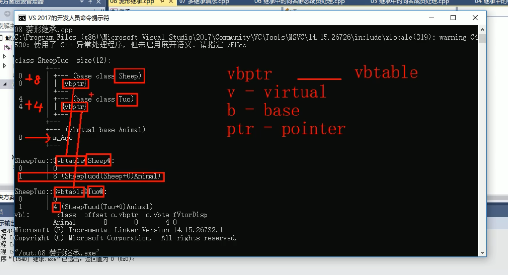

# C++的继承

# 1. 继承简介

① 继承是面向对象的三大特性之一。

② 定义类时，下级别的成员除了拥有上一级的共性，还有自己的特性。这个时候，就可以考虑利用继承技术，减少重复代码。


## 1.1 普通实现


```python
#include <iostream>
using namespace std;
#include<string>

//打印输出类
class Java
{
public:
    void header()
    {
        cout << "首页、公开课、登陆、注册...(公共头部)" << endl;
    }
    void footer()
    {
        cout << "帮助中心、交流合作、站内地图...(公共底部)" << endl;
    }
    void left()
    {
        cout << "Java、Python、C++....(公共分类列表)" << endl;
    }
    void content()
    {
        cout << "Java学科视频" << endl;
    }
};

class Python
{
public:
    void header()
    {
        cout << "首页、公开课、登陆、注册...(公共头部)" << endl;
    }
    void footer()
    {
        cout << "帮助中心、交流合作、站内地图...(公共底部)" << endl;
    }
    void left()
    {
        cout << "Java、Python、C++....(公共分类列表)" << endl;
    }
    void content()
    {
        cout << "Python学科视频" << endl;
    }
};

class CPP
{
public:
    void header()
    {
        cout << "首页、公开课、登陆、注册...(公共头部)" << endl;
    }
    void footer()
    {
        cout << "帮助中心、交流合作、站内地图...(公共底部)" << endl;
    }
    void left()
    {
        cout << "Java、Python、C++....(公共分类列表)" << endl;
    }
    void content()
    {
        cout << "C++学科视频" << endl;
    }
};

void test01()
{
    cout << "Java下载视频页面如下：" << endl;
    Java ja;
    ja.header();
    ja.footer();
    ja.left();
    ja.content();

    cout << "........................" << endl;
    cout << "Python下载视频页面如下：" << endl;
    Python py;
    py.header();
    py.footer();
    py.left();
    py.content();

    cout << "........................" << endl;
    cout << "C++下载视频页面如下：" << endl;
    CPP cpp;
    cpp.header();
    cpp.footer();
    cpp.left();
    cpp.content();
}

int main()
{
    test01();
    
    system("pause");

    return 0;

}
```

运行结果： 
 - Java下载视频页面如下：  
 - 首页、公开课、登陆、注册...(公共头部)  
 - 帮助中心、交流合作、站内地图...(公共底部)  
 - Java、Python、C++....(公共分类列表)  
 - Java学科视频  
 - ........................  
 - Python下载视频页面如下：  
 - 首页、公开课、登陆、注册...(公共头部)  
 - 帮助中心、交流合作、站内地图...(公共底部)  
 - Java、Python、C++....(公共分类列表)  
 - Python学科视频  
 - ........................  
 - C++下载视频页面如下：  
 - 首页、公开课、登陆、注册...(公共头部)  
 - 帮助中心、交流合作、站内地图...(公共底部)  
 - Java、Python、C++....(公共分类列表)  
 - C++学科视频  
 - 请按任意键继续. . .

## 1.2 继承实现


```python
#include <iostream>
using namespace std;
#include<string>

//打印输出类
class BasePage
{
public:
    void header()
    {
        cout << "首页、公开课、登陆、注册...(公共头部)" << endl;
    }
    void footer()
    {
        cout << "帮助中心、交流合作、站内地图...(公共底部)" << endl;
    }
    void left()
    {
        cout << "Java、Python、C++....(公共分类列表)" << endl;
    }
};

// 继承的好处：减少重复代码
// 语法：class 子类：继承方式 父类
// 子类 也称为 派生类
// 父类 也称为 基类

//Java页面
class Java:public BasePage   //继承了BasePage，把BasePage里面的内容全部拿到手了
{
public:
    void content()
    {
        cout << "Java学科视频" << endl;
    }
};

//Python页面
class Python :public BasePage   //继承了BasePage，把BasePage里面的内容全部拿到手了
{
public:
    void content()
    {
        cout << "Python学科视频" << endl;
    }
};

//C++页面
class CPP :public BasePage   //继承了BasePage，把BasePage里面的内容全部拿到手了
{
public:
    void content()
    {
        cout << "CPP学科视频" << endl;
    }
};

void test01()
{
    cout << "Java下载视频页面如下：" << endl;
    Java ja;
    ja.header();
    ja.footer();
    ja.left();
    ja.content();

    cout << "........................" << endl;
    cout << "Python下载视频页面如下：" << endl;
    Python py;
    py.header();
    py.footer();
    py.left();
    py.content();

    cout << "........................" << endl;
    cout << "C++下载视频页面如下：" << endl;
    CPP cpp;
    cpp.header();
    cpp.footer();
    cpp.left();
    cpp.content();
}

int main()
{
    test01();
    
    system("pause");

    return 0;

}
```

运行结果：  
 - Java下载视频页面如下：  
 - 首页、公开课、登陆、注册...(公共头部)  
 - 帮助中心、交流合作、站内地图...(公共底部)  
 - Java、Python、C++....(公共分类列表)  
 - Java学科视频  
 - ........................  
 - Python下载视频页面如下：  
 - 首页、公开课、登陆、注册...(公共头部)  
 - 帮助中心、交流合作、站内地图...(公共底部)  
 - Java、Python、C++....(公共分类列表)  
 - Python学科视频  
 - ........................  
 - C++下载视频页面如下：  
 - 首页、公开课、登陆、注册...(公共头部)  
 - 帮助中心、交流合作、站内地图...(公共底部)  
 - Java、Python、C++....(公共分类列表)  
 - CPP学科视频  
 - 请按任意键继续. . .

# 2. 三种继承改变权限

① 继承的语法：class 子类：继承方式 父类

② 继承方式一共有三种：

1. 公共继承
2. 保护继承
3. 私有继承

③ 不同的继承方式，父类中的变量被继承后，权限相应的得到了改变，如下图所示。


```python
#include <iostream>
using namespace std;
#include<string>

//打印输出类
class Base1
{
public:
    int m_A;
protected:
    int m_B;
private:
    int m_C;
};

//公共继承
class Son1:public Base1
{
public:
    void func()
    {
        m_A = 10; //父类中的公共权限成员 到子类中依然是公共权限
        m_B = 10; //父类中的保护权限成员 到子类中依然是保护权限
        //m_C = 10; //父类中的私有权限成员 子类访问不到

    }
};

void test01()
{
    Son1 s1;
    s1.m_A = 100;  //公共权限，类内能访问，类外也能访问
    //s1.m_B = 100;  //保护权限，类内能访问，类外不能访问
}

//保护继承
class Son2:protected Base1
{
public:
    void func()
    {
        m_A = 10; //父类中的公共权限成员 到子类中变为保护权限
        m_B = 10; //父类中的保护权限成员 到子类中依然是保护权限
        //m_C = 10; //父类中的私有权限成员 子类访问不到

    }
};


void test02()
{
    Son2 s2;
    //s2.m_A = 100;  //保护权限，类内能访问，类外不能访问
    //s2.m_B = 100;  //保护权限，类内能访问，类外不能访问
}

//私有继承
class Son3:private Base1
{
public:
    void func()
    {
        m_A = 10; //父类中的公共权限成员 到子类中变为私有权限
        m_B = 10; //父类中的保护权限成员 到子类中变为私有权限
        //m_C = 10; //父类中的私有权限成员 子类访问不到

    }
};

void test03()
{
    Son3 s3;
    //s3.m_A = 100;  //私有权限，类内能访问，类外不能访问
    //s3.m_B = 100;  //私有权限，类内能访问，类外不能访问
}

int main()
{

    system("pause");

    return 0;

}
```

运行结果：  
 - 请按任意键继续. . .

# 3. 继承对象内存

## 3.1 查询继承对象所占内存


```python
#include <iostream>
using namespace std;
#include<string>

//继承中的对象模型

class Base
{
public:
    int m_A;
protected:
    int m_B;
private:
    int m_C;
};


//公共继承
class Son:public Base
{
    int m_D; 
};

//利用开发人员命令提示工具查看对象模型
//跳转盘符→F:
//跳转文件路径→cd 具体路径下
//查看命令
//cl /d1 reportSingleClassLayout查看的类名 "文件名"

void test01()
{
    //父类中所有非静态成员属性都会被子类继承下去
    //父类中私有成员属性 是被编译器给隐藏了，因此是访问不到，但是确实被继承下去了
    cout << "size of Son =" << sizeof(Son) << endl;  //16个字节，父类3个int一个12个字节，字节1个int4个字节                        
}

int main()
{
    test01();

    system("pause");

    return 0;

}
```

运行结果：  
 - size of Son =16  
 - 按任意键继续. . .

## 3.2 VS自带开发工具查询

① 首先打开visio studio的开发人员命令工具，如下图所示。


② 查询visio studio的项目所在地址。

③ "输入跳转盘符，例如，C:"->"输入项目所在地的地址"->"输入dir(查询项目中文件信息)"


② 输入：cl(空格)/d1 reportSingleClassLayout查看的类名 "文件名"，可以查看类所占内存空间大小。


# 4. 继承构造和析构顺序

① 继承中，先调用父类构造函数，再调用子类构造函数，析构顺序与构造顺序相反，先调用子类析构函数，再调用父类析构函数。


```python
#include <iostream>
using namespace std;
#include<string>

//继承中的构造和析构顺序

class Base
{
public:
    Base()
    {
        cout << "Base构造函数！" << endl;
    }

    ~Base()
    {
        cout << "Base析构函数！" << endl;
    }
};


//
class Son:public Base
{
public:
    Son()
    {
        cout << "Son构造函数！" << endl;
    }

    ~Son()
    {
        cout << "Son析构函数！" << endl;
    }
};


void test01()
{
    //Base b;  //创建父类对象只有父类的构造函数、析构函数

    //继承中的构造和析构顺序如下：
    //先构造父类、再构造子类，析构的顺序与构造的顺序相反
    Son s;
}


int main()
{
    test01();

    system("pause");

    return 0;

}
```

运行结果：  
 - Base构造函数！  
 - Son构造函数！  
 - Son析构函数！  
 - Base析构函数！  
 - 请按任意键继续. . .

# 5. 同名成员处理

① 子类对象可以直接访问到子类中同名成员。

② 子类对象加作用域可以访问到父类同名成员。

③ 当子类与父类拥有同名的成员函数，子类会隐藏父类中所有同名成员函数(有参、无参)，加作用域才可以访问到父类中同名函数。


```python
#include <iostream>
using namespace std;
#include<string>


//继承中同名成员处理

class Base
{
public:
    Base()
    {
        m_A = 100;
    }
    int m_A;
    
    void func()
    {
        cout << "Base - func()调用" << endl;
    }

    void func(int a)
    {
        cout << "Base - func(int a)调用" << endl;
    }
};

class Son:public Base
{
public:
    Son()
    {
        m_A = 200;
    }

    void func()
    {
        cout << "Son - func()调用" << endl;
    }

    int m_A;
};

//同名成员属性处理方式
void test01()
{
    Son s;
    cout << "Son 下 m_A=" << s.m_A << endl;
    //如果通过子类对象访问到父类中同名成员，需要加作用域
    cout << "Base 下 m_A=" << s.Base::m_A << endl;  

}

//同名成员函数处理方式
void test02()
{
    Son s;
    s.func(); //直接调用 调用时子类中的同名成员

    //调用父类中同名成员函数
    s.Base::func();

    //如果子类中出现和父类同名的成员函数，子类的同名成员会隐藏掉父类中所有同名成员函数
    //如果想访问到父类中被隐藏的同名成员函数，需要加作用域
    s.Base::func(100);
}

//同名成员函数处理
int main()
{
    test01();
    test02();
    
    system("pause");

    return 0;

}
```

运行结果：  
 - Son 下 m_A=200  
 - Base 下 m_A=100  
 - Son - func()调用  
 - Base - func()调用  
 - Base - func(int a)调用  
 - 请按任意键继续. . .

# 6. 同名静态成员处理

① 静态成员和非静态成员出现同名，处理方式一致：

1. 访问子类同名成员，直接访问
2. 访问父类同名成员，需要加作用域

② 加上static关键字后，成员发生变化，成员变成静态成员。

③ 静态成员变量特点：
1. 所有对象都共享同一份数据。
2. 编译阶段就分配内存。
3. 类内声明，类外初始化。

④ 静态成员函数特点：
1. 只能访问静态成员变量，不能访问非静态成员变量。
2. 所有对象都共享同一份函数实例。


```python
#include <iostream>
using namespace std;

//继承中同名静态成员处理方式
class Base
{
public:
    
    static int m_A;  //静态成员类内声明，类外初始化

    static void func()
    {
        cout << "Base - static func()" << endl;
    }

    static void func(int a)
    {
        cout << "Base - static func(int a)" << endl;
    }
};

int Base::m_A=100;

class Son:public Base
{
public:

    static int m_A;

    static void func()
    {
        cout << "Son - static void func()" << endl;
    }
};

int Son::m_A = 200;

//同名静态成员属性
void test01()
{
    //1、通过对象访问
    Son s;
    cout << "Son 下 m_A = " << s.m_A << endl;
    cout << "Base 下 m_A = " << s.Base::m_A << endl;

    //2、通过类名访问
    cout << "Son 下 m_A = "<< Son::m_A << endl;
    //第一个::代表通过类名方式访问  第二个::代表访问父类作用域
    cout << "Base 下 m_A= "<< Son::Base::m_A << endl;  
}

void test02()
{
    //1、通过对象访问
    Son s;
    s.func();
    s.Base::func();

    //2、通过类名访问
    Son::func();
    Son::Base::func();

    //子类出现和父类同名静态成员函数，也会隐藏掉父类中所有同名成员函数
    //如何想访问父类中被隐藏同名成员，需要加作用域
    Son::Base::func(100);
}

//同名成员函数处理
int main()
{
    test01();
    test02();
    
    system("pause");

    return 0;

}
```

运行结果：  
 - Son 下 m_A = 200  
 - Base 下 m_A = 100  
 - Son 下 m_A = 200  
 - Base 下 m_A= 100  
 - Son - static void func()  
 - Base - static func()  
 - Son - static void func()  
 - Base - static func()  
 - Base - static func(int a)  
 - 请按任意键继续. . .

# 7. 多继承语法

① C++运行一个类继承多个类。

② 语法：class 子类：继承方式 父类1，继承方式 父类2，.....

③ 多继承可能会引发父类中有同名成员出现，需要加作用域区分。

④ C++实际开发中不建议用多继承。


```python
#include <iostream>
using namespace std;

class Base1
{
public:
    
    Base1()
    {
        m_A = 100;
    }
    
    int m_A;

};

class Base2
{
public:

    Base2()
    {
        m_A = 200;
    }

    int m_A;

};

//子类  需要继承Base1和Base2
//语法：class 子类：继承方式 父类1，继承方式 父类2，.....
class Son:public Base1,public Base2
{
public:

    Son()
    {
        m_C = 300;
        m_D = 400;
    }

    int m_C;
    int m_D;
};

void test01()
{
    Son s;

    cout << "sizeof(Son):" << sizeof(s) << endl;
    //当父类中出现同名成员，需要加作用域区分
    cout << "Base1::m_A = " << s.Base1::m_A << endl;
    cout << "Base2::m_A = " << s.Base2::m_A << endl;

}

int main()
{
    test01();

    system("pause");

    return 0;

}
```

运行结果：  
 - sizeof(Son):16  
 - Base1::m_A = 100  
 - Base2::m_A = 200  
 - 请按任意键继续. . .

# 8. 菱形继承

## 8.1 菱形继承简介

① 菱形继承概念：

1. 两个派生类继承同一个基类
2. 又有某个类同时继承两个派生类
3. 这种继承被称为菱形继承

② 羊继承了动物的数据，驼同样继承了动物的数据，当草泥马使用数据是，就会产生二义性。

③ 草泥马继承自动物的数据继承了两份，其实我们应当清楚，这份数据我们只需要一份就可以。

④ 菱形继承带来的主要问题是子类继承两份相同的数据，导致资源浪费以及毫无意义。

⑤ 利用虚继承可以解决菱形继承问题。


## 8.2 菱形继承普通方式


```python
#include <iostream>
using namespace std;

//动物类
class Animal
{
public:
    int m_Age;
};

//羊类
class Sheep:public Animal{};

//驼类
class Tuo:public Animal{};

//羊驼类
class SheepTuo:public Sheep,public Tuo{};

void test01()
{
    SheepTuo st;

    st.Sheep::m_Age = 18;
    st.Tuo::m_Age = 28;

    //当出现菱形继承，两个父类拥有相同数据，需要加以作用域区分
    cout << "st.Sheep::m_Age="<< st.Sheep::m_Age << endl;
    cout << "st.Tuo::m_Age=" << st.Tuo::m_Age << endl;

    //这份数据我们知道 只有一份就可以，菱形继承导致数据有两份，资源浪费
}

int main()
{
    test01();

    system("pause");

    return 0;
}
```

运行结果： 
 - st.Sheep::m_Age=18  
 - st.Tuo::m_Age=28  
 - 请按任意键继续. . .

## 8.3 菱形继承虚继承

### 8.3.1 菱形继承虚继承方式


```python
#include <iostream>
using namespace std;

//动物类
class Animal
{
public:
    int m_Age;
};

//利用虚继承 解决菱形继承的问题
//继承之前 加上关键字 virtual 变成 虚继承
//虚继承后，Animal类 称为 虚基类

//羊类
class Sheep:virtual public Animal{};

//驼类
class Tuo:virtual public Animal{};

//羊驼类
class SheepTuo:public Sheep,public Tuo{};

void test01()
{
    SheepTuo st;

    st.Sheep::m_Age = 18;
    st.Tuo::m_Age = 28;

    //当出现菱形继承，两个父类拥有相同数据，需要加以作用域区分
    cout << "st.Sheep::m_Age="<< st.Sheep::m_Age << endl;
    cout << "st.Tuo::m_Age=" << st.Tuo::m_Age << endl;

    //虚继承，多产生一种输出方式(因为上面两个是同一份数据，所以可以不加作用域来区分了)
    cout << "st.m_Age=" << st.m_Age << endl;
}

int main()
{
    test01();

    system("pause");

    return 0;
}
```

运行结果：  
 - st.Sheep::m_Age=28  
 - st.Tuo::m_Age=28  
 - st.m_Age=28   
 - 请按任意键继续. . .

### 8.3.2 菱形继承虚继承VS查询

① Sheep类和Tuo类继承的都是vbptr，vbptr为虚基类继承指针。
1. v - virtual
2. b - base
3. ptr = pointer

② 菱形继承并不是继承两份数据，而是继承两份指针，这两个指针会分别指向虚基类表，虚基类表中会记录偏移量，加上这个偏移量，会指向这个唯一的数据。


