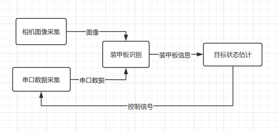

# ROS2

## 安装

> 注意：由于我们的代码目前没有做jazzy版本的适配，现在ROS2选择安装的版本为humble

**一键安装ROS2**

```shell
wget http://fishros.com/install -O fishros && . fishros
```

输入密码，在选项界面选择1-一键安装ROS，接着根据你的情况选择是否更换系统源，接着等待一会就会让你选择要安装的ROS2版本了。这里选择humble版本的ROS2即可。

接着会问你安装桌面版还是基础版，我们选择桌面版，包含可视化工具，如果是在树莓派上装可以使用基础版。

**手动安装ROS2**

[动手安装ROS2](https://fishros.com/d2lros2/#/humble/chapt1/get_started/3.动手安装ROS2)：鱼香ROS安装教程

[Installation — ROS 2 Documentation: Humble documentation](https://docs.ros.org/en/humble/Installation.html)：官方安装教程

## 介绍

**简介：**

​	ROS，即Robot Operating System，是一套用于机器人开发的软件库和工具集。

**ROS2主要提供了：**

1. 话题、服务、参数、动作四种通讯机制，及其对应的管理、调试工具(命令行、rqt)
2. 机器人中常用的数据类型接口（比如速度geometry_msgs/msg/TwTwist、里程计数据sensor_msgs/msg/Imu等）
3. urdf机器人描述语言、rviz可视化界面、gazebo仿真环境、rosbag数据录制工具

**为何要使用ROS：**

1. 简化机器人开发任务、不重复造轮子
2. 模块化开发+通信机制，方便调试




如以上的简化的自瞄框架，每一个矩形都代表一个ROS节点，每一个箭头都代表通过ROS的的某种通信方式去传递信息。

## 初次体验

[鱼香ros:ROS2初体验](https://fishros.com/d2lros2/#/humble/chapt1/get_started/4.ROS2%E5%88%9D%E4%BD%93%E9%AA%8C)

### 游戏1：你说我听

游戏内容：很简单，我们启动两个节点，一个节点负责发消息(说)，一个节点负责收消息（听）。

1. 启动一个终端Ctrl+Alt+T

2. 启动倾听者

   ```
   ros2 run demo_nodes_py listenerCopy to clipboardErrorCopied
   ```

3. **启动一个新终端Ctrl+Alt+T**

4. 启动说话者

   ```
   ros2 run demo_nodes_cpp talkerCopy to clipboardErrorCopied
   ```

观察一下现象，talker节点每数一个输，倾听节点每一次都能听到一个，是不是很神奇。

### 游戏2：涂鸦乌龟

游戏内容：启动海龟模拟器，启动海龟遥控器，控制海龟在地图上画出任意轨迹即可。

1. 启动海龟模拟器

   打开终端Ctrl+Alt+T,输入下面的指令

   ```shell
   ros2 run turtlesim turtlesim_nodeCopy to clipboardErrorCopied
   ```

2. 启动海龟遥控器

   点一下原来的终端输入Ctrl+Shift+T 打开一个新的标签页输入

   ```shell
   ros2 run turtlesim turtle_teleop_key
   ```

### RQT可视化

**打开rqt**

保持前面两个游戏在运行状态，打开终端，输入rqt。

```bash
rqt
```

**选择插件**

这里我们可以选择现有的几个RQT插件来试一试，可以看到和话题、参数、服务、动作四大通信组件相关的工具都有，还有一些可视化、日志和系统计算图等相关的。

选择`Introspection / Node Graph`，查看节点图

## 第一个节点


## 编译方式

> ament_make

### CMakeLists.txt


### Package.xml

**1. package.xml是什么**

如果说CMakeLists.txt是告诉计算机如何构建你的代码的“构建清单”，那么package.xml就是告诉人类和其他程序，你的软件包是什么、依赖谁的“软件包说明书”。

它是一个标准的XML格式文件，是ROS生态中必不可少的一部分。每个ROS软件包都必须包含一个 package.xml文件，它位于包的根目录下，和 CMakeLists.txt是邻居。

没有它行不行？ 在ROS里不行。ROS 的工具（如命令colcon build）就依赖这个文件，一用于计算机识别这是一个ROS包，二用于查找该包依赖的其他的ROS包（比如你用了别人的代码，或者用了ROS提供的功能），三用于提供包的元信息（Meta-Information），比如名字、版本、作者、许可证。这些信息对于软件的分发和共享至关重要。听不懂不要紧，以后会接触到。

**2. package.xml的写法**

package.xml的内容虽然看起来有点复杂，但核心就是“声明属性”和“声明依赖”。

一个最基本的package.xml长这样：

```xml
<?xml version="1.0"?>
<?xml-model href="http://download.ros.org/schema/package_format3.xsd" schematypens="http://www.w3.org/2001/XMLSchema"?>
<!-- 1. 声明包的基本信息 -->
<package format="3">
  <name>my_awesome_package</name>
  <version>0.0.0</version>
  <description>这是一个超级厉害的ROS包，用来做视觉识别。</description>
  <maintainer email="your-email@example.com">Your Name</maintainer>
  <license>MIT</license>

  <!-- 2. 声明构建依赖 -->
  <buildtool_depend>ament_cmake</buildtool_depend>

  <!-- 3. 声明运行依赖 -->
  <depend>rclcpp</depend>
  <depend>std_msgs</depend>
  <depend>sensor_msgs</depend>

  <!-- 4. 导出其他信息，例如需要被发现的插件 -->
  <export>
    <build_type>ament_cmake</build_type>
  </export>
</package>
```

**3. package.xml 和 CMakeLists.txt 的关系**

可以把它们看作一对好兄弟，分工合作：

    package.xml (说明书): 对外。负责社交，告诉外界“我是谁，我需要哪些依赖”。
    
    CMakeLists.txt (构建清单): 对内。负责干活，指挥编译器“怎么把我自己的代码和外来给的零件组装成产品”。

当你运行 colcon build 命令时，构建系统会：

    1. 先读取所有包的package.xml，解析出一个依赖关系图。搞清楚谁依赖谁，决定构建顺序。
    
    2. 再按照依赖顺序，依次调用每个包里的CMakeLists.txt来真正执行编译。

**4. 如何使用（它不需要单独运行）**

package.xml 文件不需要你单独去运行它。它的使用是自动的，融合在 ROS 的构建流程中。

    1. 创建包时：当你使用ros2 pkg create ...命令创建一个新包时，ROS 会自动为你生成一个模板 package.xml，你只需要去修改它即可。
    
    2. 构建时：当你在其工作空间的根目录下运行colcon build时，工具会自动找到所有包的package.xml并处理它们。
    
    3. 查询信息时：你可以用 ROS 工具命令来查看包的信息，这些信息就来自 package.xml。

抽象成命令就是：

```shell
# 跳到你的工作空间源码目录下
cd ~/ros2_ws/src

# 创建一个新的包，会自动生成package.xml
ros2 pkg create --build-type ament_cmake my_awesome_package

# 构建后，查看某个包的信息
ros2 pkg list # 列出所有包
ros2 pkg xml my_awesome_package # 输出指定包的package.xml内容
```

## 话题


## 回调


## 服务


## 参数


## 动作


## 自定义消息类型


## TF


## Launch


## 工具


> 推荐参考资料：
>
>
> 作业：
>
> 
> 

