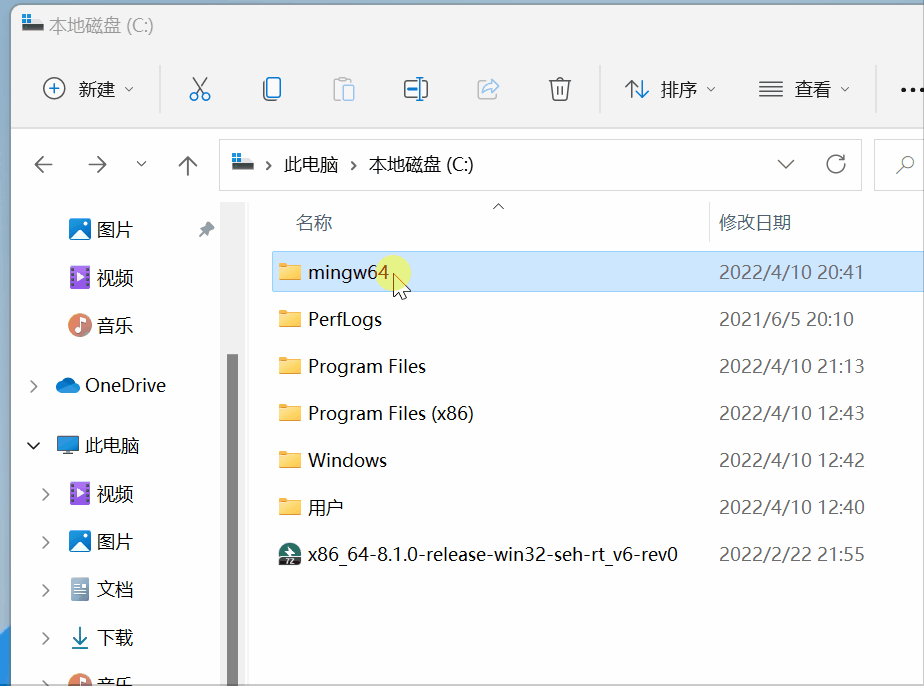
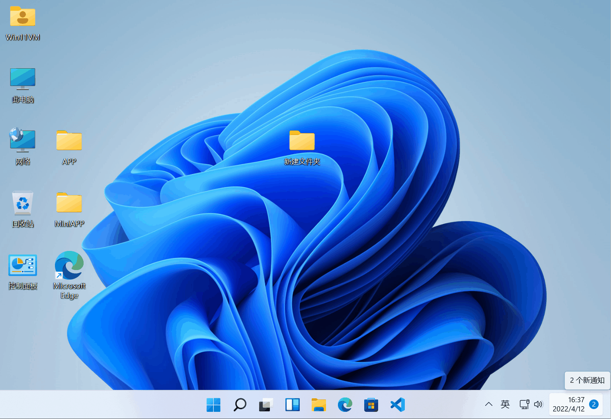

# VScode中配置 C/C++ 环境

**本篇改自@零流@火星动力猿的配置文档，仅供队内参考使用，切勿用作商业用途**

---------------------------------
  Tip：请在电脑端查看

**\@零流@火星动力猿 2022.4.12**

## 1. 下载编辑器VScode

-   官网：[https://code.visualstudio.com/](https://code.visualstudio.com/)（点链接时按下Ctrl，不会覆盖当前页面哦^-^）


-   安装VScode（建议附加任务全部勾选）


## 2. 下载编译器MinGW并解压

-   官网：[https://www.mingw-w64.org/](https://www.mingw-w64.org/)
-   github:
    [https://github.com/niXman/mingw-builds-binaries/releases](https://github.com/niXman/mingw-builds-binaries/releases)

 
  

-   **安装包可以在任意位置解压(但路径不能包含中文)**，比如我选择解压在F盘，参考教程文档选择下载C盘


## 3. 将MinGW添加至环境变量

-   进入mingw64下的bin文件夹，复制当前路径，Win+i唤起系统设置，输入高级系统设置并进入，点击环境变量，选择path，编辑，新建，粘贴路径，按下三个确定**(部分电脑在这一步配完后需要重启配置才能生效)**



## 4. 配置VScode插件

-   打开VScode安装插件 `Chinese` 和 `C/C++` ，等待安装完毕后重启VScode


-   若重启后还是显示英文，按快捷键`Ctrl+Shift+P`


点击上面第一个**配置显示语言**，没显示就输入`Configure Display Language`，点击确认即可


-   切换C/C++插件至 `1.8.4` 版本【**可选**】


> 因最新版本不会自动生成launch.json文件，给后续优化带来不便，故退回旧版本。\
> 但经过实践发现即使老版本也有可能无法自动生成launch.json文件，故后续会复制一段launch文件供各位自行生成粘贴

## 5. 运行代码

### C语言

-   新建文件夹，修改为英文名称并进入，右键 `通过Code打开`
    若在安装时未勾选相关选项，可能没有这个选项，请自行在VScode内操作打开文件夹
-   新建一个文件，英文命名且扩展名为 `.c`
-   编写相关代码

``` c
#include <stdio.h>
#include <stdlib.h>
int main()
{
    printf("Hello World!\n");
    printf("你好世界！\n");
    system("pause");    // 防止运行后自动退出，需头文件stdlib.h
    return 0;
}
```

-   VScode菜单栏，点击运行，启动调试，稍等程序运行，输出结果在下方终端，上方调试面板，点击最右边的
    `橙色方框` 停止程序运行



**注意这一步会生成一个带有tasks.json的文件夹.vscode(无launch.json)如果没有就自己建一个**


- 然后创建launch.json。将这段内容粘贴进去

``` json
{
    "version": "0.2.0",
    "configurations": [
        {
            "name": "C/C++: gcc.exe 调试活动文件（集成终端）",
            "type": "cppdbg",
            "request": "launch",
            "program": "${fileDirname}\\${fileBasenameNoExtension}.exe",
            "args": [],
            "stopAtEntry": false,
            "cwd": "${fileDirname}",
            "environment": [],
            "externalConsole": true,//自动生成的一般是false，这里改为true可以在调试时使用集成终端
            "MIMode": "gdb",
            "miDebuggerPath": "F:\\Download\\mingw64\\bin\\gdb.exe", //这一步选择自己的gdb.exe路径，注意是双反斜杠
            "setupCommands": [
                {
                    "description": "为 gdb 启用整齐打印",
                    "text": "-enable-pretty-printing",
                    "ignoreFailures": true
                }
            ],
            "preLaunchTask": "C/C++: gcc.exe 生成活动文件"
        }
    ]
}
```

- 接着把tasks.json内容变成这个

``` json
{
    "tasks": [
        {
            "type": "cppbuild",
            "label": "C/C++: gcc.exe 生成活动文件",
            "command": "F:\\Download\\mingw64\\bin\\gcc.exe",//改成自己的路径
            "args": [
                "-fdiagnostics-color=always",
                "-g",
                "${file}",
                "-o",
                "${fileDirname}\\${fileBasenameNoExtension}.exe"
            ],
            "options": {
                "cwd": "${fileDirname}"
            },
            "problemMatcher": [
                "$gcc"
            ],
            "group": {
                "kind": "build",
                "isDefault": true
            },
            "detail": "调试器生成的任务。"
        }
    ],
    "version": "2.0.0"
}
```

- 最后.vscode文件夹应该有这两个文件


### C++

-   新建文件夹，修改为英文名称并进入，右键 `通过Code打开`
    若在安装时未勾选相关选项，可能没有这个选项，请自行在VScode内操作打开文件夹
-   新建一个文件，英文命名且扩展名为 `.cpp`
-   编写相关代码

``` cpp
#include <iostream>
using namespace std;

int main()
{
    cout << "Hello, World!" << endl;
    cout << "你好世界！" << endl;
    system("pause");   
    return 0;
}
```

-   VScode菜单栏，点击运行，启动调试，稍等程序运行，输出结果在下方终端，上方调试面板，点击最右边的
    `橙色方框` 停止程序运行


**注意这一步会生成一个带有tasks.json的文件夹.vscode(无launch.json)**


- 然后修改tasks.json（第6步的调整与优化），记得按组合键`Ctrl + s`保存
- 然后点击左侧的`运行与调试`，再点击`创建launch.json文件`。搜索框会弹出选项，选择`C++(GDB/LLDB)`。然后 VS Code 会新建一个 JSON 文件，点击右下角的`添加配置`，在弹出的下拉菜单中选择`C/C++：（gdb）启动`。
- 再修改"program"（exe文件位置），"miDebuggerPath"（安装的 MinGW-W64 的 gdb 工具的路径），添加"preLaunchTask"（启动调试会话之前执行特定任务，这里写tasks.json的"label"中的内容）
- 然后设置断点测试


------

- 如果自动创建文件失败，可以手动创建.vscode文件夹和tasks.json和launch.json。将以下内容粘贴进去，对应位置修改。
- `tasks.json`

```json
{
    "tasks": [
        {
            "type": "cppbuild",
            "label": "C/C++: g++.exe 生成活动文件",
            "command": "D:\\configuration\\mingw64\\bin\\g++.exe", //改为自己的路径
            "args": [
                "-fdiagnostics-color=always",
                "-g",
                "${file}",
                "-o",
                "${fileDirname}\\build\\${fileBasenameNoExtension}.exe", //可执行文件保存在build文件夹下
                "-fexec-charset=GBK" //解决中文乱码
            ],
            "options": {
                "cwd": "${fileDirname}"
            },
            "problemMatcher": [
                "$gcc"
            ],
            "group": {
                "kind": "build",
                "isDefault": true
            },
            "detail": "调试器生成的任务。"
        }
    ],
    "version": "2.0.0"
}
```

- `launch.json`

``` json
{
    "version": "0.2.0",
    "configurations": [
        {
            "name": "(gdb) 启动",
            "type": "cppdbg",
            "request": "launch",
            "program": "${fileDirname}\\build\\${fileBasenameNoExtension}.exe", //可执行文件的路径
            "args": [],
            "stopAtEntry": false,
            "cwd": "${fileDirname}",
            "environment": [],
            "externalConsole": true, //自动生成的一般是false，这里改为true可以在调试时使用集成终端
            "MIMode": "gdb",
            "miDebuggerPath": "D:\\configuration\\mingw64\\bin\\gdb.exe", //这一步选择自己的gdb.exe路径，注意是双反斜杠
            "setupCommands": [
                {
                    "description": "为 gdb 启用整齐打印",
                    "text": "-enable-pretty-printing",
                    "ignoreFailures": true
                },
                {
                    "description": "将反汇编风格设置为 Intel",
                    "text": "-gdb-set disassembly-flavor intel",
                    "ignoreFailures": true
                }
            ],
            "preLaunchTask": "C/C++: g++.exe 生成活动文件" //与tasks.json的"label"相同
        }

    ]
}
```

- 最后.vscode文件夹应该有这两个文件


## 6. 调整和优化

> 请根据自己的需要进行优化\
> 代码运行后 `.vscode` 文件夹会自动生成在你的源文件目录下\
> `.vscode` 文件夹下的 `tasks.json` 和 `launch.json`
> 用来控制程序的运行和调试

-   将程序运行在外部控制台【推荐】
    -   打开`.vscode` 文件夹下的 `launch.json` 文件，找到
        `"externalConsole": false,` 将 `false` 改为 `true` 并保存
    -   
-   解决中文乱码问题【推荐】
    -   打开`.vscode` 文件夹下的 `tasks.json` 文件，找到
        `"${fileDirname}\\${fileBasenameNoExtension}.exe"`
        在后面加上英文逗号，然后回车到下一行，粘贴下面文本
        `"-fexec-charset=GBK"` 并保存
    -   
-   收纳生成的 `exe` 可执行文件【可选】
    -   打开`.vscode` 文件夹下的 `tasks.json` 文件，找到
        `"${fileDirname}\\${fileBasenameNoExtension}.exe"`
    -   修改成 `"${fileDirname}\\coin\\${fileBasenameNoExtension}.exe"`
        并保存，同理，`launch.json` 下也有相同的字段，需要你修改
    -   在源文件同目录下新建 `coin`
        文件夹，程序运行后，可执行文件将会生成在里面（其中 `coin`
        可修改成你喜欢的英文名字）

> 这样 `.c` 文件一多起来的时候，就不会出现 `.exe` 和 `.c`
> 相互穿插在目录中^-^


## 7. 提示

-   若源代码文件夹含有中文路径，将会无法编译程序。
-   若你的Windows用户名使用了中文，可能无法运行。
-   我知道GIF的自动播放，让你不知从何看起，没办法┗( T﹏T )┛
-   如果你在使用过程中遇到问题，可以尝试重启VScode或电脑，或者重新安装VScode和MinGW。
-   若出现**检测到 #include 错误。请更新
    includePath**这个问题，请参考[知乎文章](https://www.zhihu.com/question/490623669/answer/2951990691?share_code=YPrzaAJN2rtO&utm_psn=1940195484649103455)

## 8. 例行格式条款

-   本文以自身分享为主，文中的提到的包括但不限于电脑操作、软件安装、点击链接，作者不保证有效性和可能发生的不利后果。
-   如需转载请在开头注明作者和出处
