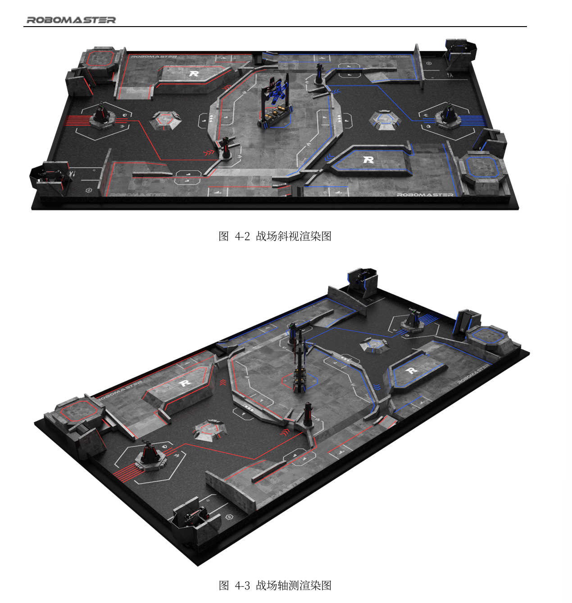
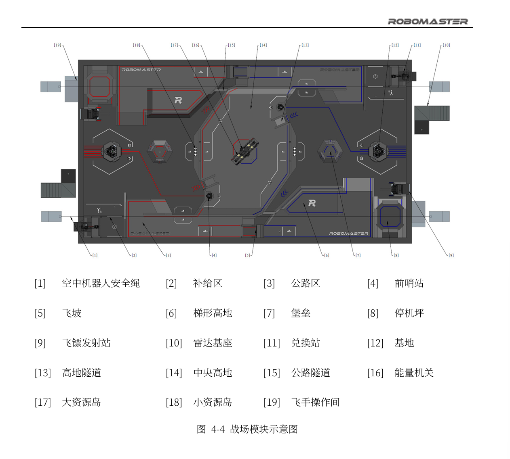
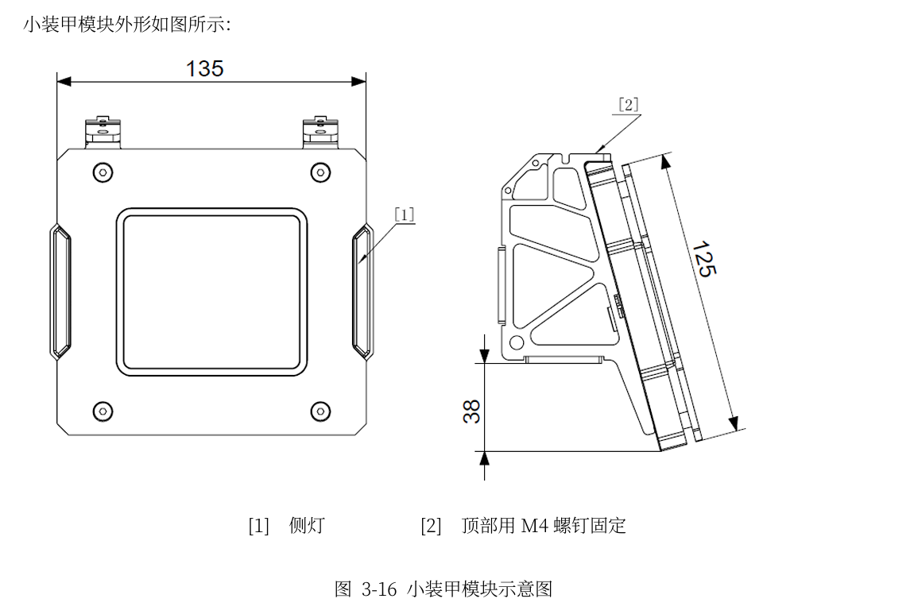
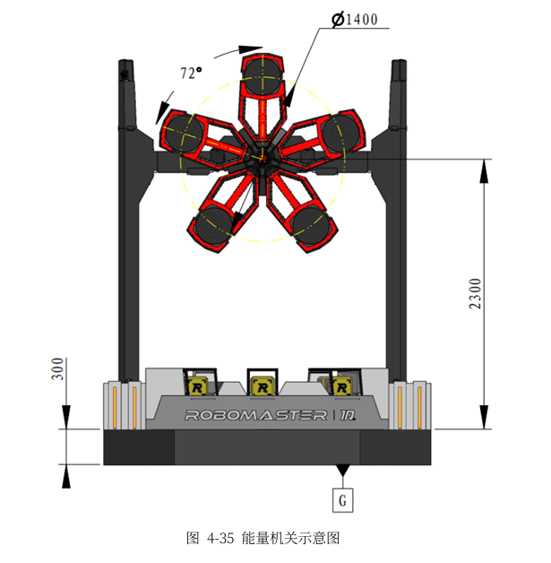
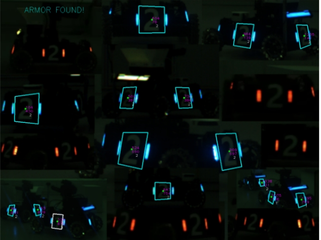
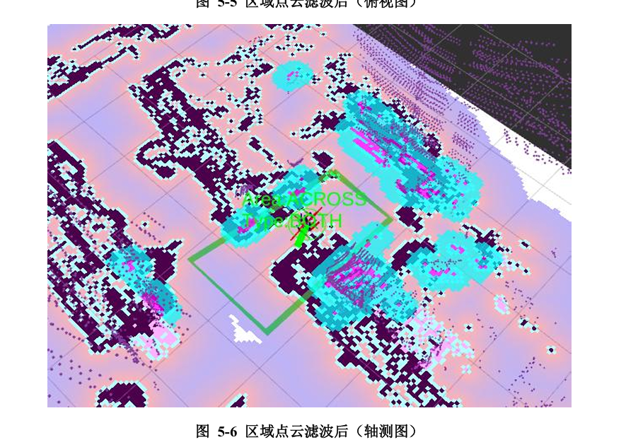
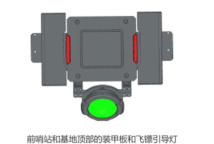

# Robomaster视觉组介绍

## 1.视觉组是什么

- 视觉组负责的机器人模块主要是**传感器**和**数据处理**，即通过对相机、激光雷达等传感器采集到的信息进行处理从而让机器人在一定程度上具有**感知能力**和**智能行为**。
- 通俗来说，视觉组的工作相当于制作你在游戏中开各种的外挂，只不过这种外挂是官方允许的（~~别人都开，你不开就只能被爆杀~~）。

## 2.视觉在各兵种中的作用

先介绍下会提到的一些名词

- 场地模块





- 装甲板
  
- 能量机关
  

- 兵种
  - 英雄机器人：英雄机器人是战场上唯一可以发射42mm弹丸的机器人。
  - 工程机器人：工程机器人可以搬运并兑换矿石，以换取金币。
  - 步兵机器人：步兵机器人可以发射17mm弹丸。
  - 空中机器人：空中机器人可发起空中支援，获得第一视角画面并从空中发射17mm弹丸。
  - 哨兵机器人：哨兵机器人需全自动运行，可以发射17mm弹丸。
  - 飞镖系统：飞镖系统可通过发射飞镖攻击对方前哨站、基地。
  - 雷达：雷达可自主获取战场信息，并通过多机通信向己方机器人或裁判系统选手端发送信息。

### 自瞄系统（步兵、英雄、哨兵、无人机）——锁头挂

由于机器人可以高速移动和旋转，前哨站在3分钟前会以0.8π rad/s的速度转动，大能量机关的变速转动，手动瞄准击打的效果往往并不是很好，这时候自瞄就非常重要。

自瞄通过获取相机图像，识别，定位，预测等处理后，得到击打装甲板（或能量机关的扇叶）所需的枪口朝向等信息，发送给电控，使得电控可以通过控制云台旋转对装甲板（或能量机关的扇叶）进行自动瞄准。




### 导航系统（哨兵）——ai队友

大家也许听说过永杰无间的ai队友，哨兵在rm中就充当这一角色。哨兵有自主决策和导航的能力，能通过雷达感知当前环境，确定自己所在的位置，自主做出决策并执行。除此以外，云台手可以花费金币通过裁判系统选手端相关指令干预哨兵机器人的行动。

由于哨兵有较高的初始性能，再加上强大的自主决策能力，能配合其他机器人开展诸多战术。

现在步兵，英雄机器人也可以选择半自动的操作方式，操作手失去图传画面，可以通过在大地图界面点击向机器人发送指令控制机器人。之后可能更多机器人都要部署导航系统。



### 雷达——视野挂

雷达被放置在场边的一处高地上，拥有全局视野。利用目标检测算法和三维重建、反向投影等，可以定位敌方机器人在场上的位置。随后，我们能利用这些信息为我方制作一张实时更新的“小地图”，掌握对方机器人的动向，以帮助我方操作手进行战术决策，做到知己知彼而百战不殆。

若己方的雷达可识别对方地面机器人的位置与实际位置接近，准确标记一段时间后，将触发易伤机制。


### 视觉兑矿（工程）——脚本挂

如果拥有视觉兑矿的能力，工程机器人可以选择自动兑矿的操作方式，在兑换矿石期间，操作手将失去图传画面，上位机通过相机采集到的画面，识别兑换槽的位姿，控制机械臂快速完成兑换。自动兑矿操作方式下，获得的经济提升50%。

### 飞镖系统——制导导弹

飞镖可以对建筑物造成大量伤害，根据目标的选择还可以造成致盲和溅伤效果。



而通过识别前哨战和基地顶部的引导灯可以辅助实现主动制导。

------

这里贴一个东北大学视觉组的视频，便于大家直观地了解（点赞支持作者）

[【RM】这五分钟是我对视觉组的全部理解_bilibili](https://www.bilibili.com/video/BV1FRbbzgEFB/?spm_id_from=333.337.search-card.all.click&vd_source=7df607ce0dfe82bffce2f94b593a642a)

## 3.你将在视觉组中学到什么

### 编程语言

C++：视觉组主要使用的编程语言

python：用来进行一些脚本编写，同时也是深度学习领域常用语言

shell：我们和Ubuntu直接沟通的重要⼯具，在终端中输入命令或编写脚本来操作计算机。

### 软件开发基础

ubuntu：Linux的发行版本，视觉组程序开发和部署的操作系统

git：代码的版本管理工具

CMake：帮你管理你多个C++的源文件、头文件、动态库和静态链接库的编译、安装和分发

### 算法库

OpenCV：开源的计算机视觉库

ROS2： 一套开源的、为机器人软件开发所设计的中间件框架

PCL： 一个大规模的、开源的、用于处理3D点云数据的算法库

Navigation2：ROS 2 生态中的官方导航软件栈

.....

### 常用工具

VSCode：轻量强大的代码编辑器，拥有丰富的插件

Markdown：一种轻量级标记语言，排版语法简洁

NoMachine：远程桌面访问软件，方便我们访问车载小电脑的桌面进行代码部署调试

Foxglove：数据可视化工具

......

## 4.推荐的学习内容

虽然上面提到的内容看上去比较多，但并不需要完全掌握，我们会在学习完基础内容后，让大家按照感兴趣的兵种任务学习，并且编程语言和软件开发基础等内容是在学习编程过程中早晚需要掌握的，对大家的学习和将来的工作都有帮助。

列举一些现阶段推荐的学习内容：

### Markdown 写作

- 基本介绍

  Markdown是一种轻量级标记语言，排版语法简洁，让人们更多地关注内容本身而非排版。它使用易读易写的纯文本格式编写文档，可与HTML混编，可导出 HTML、PDF 以及本身的.md格式的文件。

- 写作软件

  - Typora 
  - VS Code + Markdown All in One + Markdown Preview Enhanced 
  - 其他

- 学习参考

  - Markdown 基本语法： https://markdown.com.cn/basic-syntax/
  - Markdown 教程： https://www.runoob.com/markdown/md-tutorial.html

### C++

- 课程

  - [C++教程从0到1入门编程](https://www.bilibili.com/video/BV1et411b73Z/)

- 网站

  - [C++ 教程 | 菜鸟教程](https://www.runoob.com/cplusplus/cpp-tutorial.html)

- 书籍

  - **C++ Primer Plus**

    ⼗分详细的C++参考书，堪称C++标准的复述。适合没有基础的同学作为过渡。

  - **C++ Primer**

    本书的定位是程序员的第⼀本C++教程，适合于有⼀定的开发经验，对编写、编译和运行程序有了⼀定了解后的学习者。

- 算法

  - 洛谷 https://www.luogu.com.cn/ 

    请大家注册账号，并尝试自己做一些习题。我们考核预计将在洛谷上进行。

### 计算机基础

- 计算机速成课  https://www.bilibili.com/video/av21376839

  该课程将帮助大家快速了解计算机以及相关知识，内容轻松愉快，大家可以在闲暇的时候看一看。

## 杂谈

### 关于《了解CV和Robomaster视觉组》

[《了解CV和Robomaster视觉组》](https://github.com/NeoZng/vision_tutorial/blob/v1.0.0/了解CV和RoboMaster视觉组.md)由前视觉组组长曾庆铖编写，本文档就部分引用了其中的内容。大家说看到300多页畏惧了，作为新人，第一次看难免看得一头雾水，可以选择跳过技术部分，优先阅读第2，7，8章作为了解。大家可以点击链接，Star支持原作者。

### C++环境配置

参考群文件，与配置C语言环境基本相同，只需将`tasks.json`中的`gcc.exe`的路径改为`g++.exe`的路径即可

即：

`tasks.json`

```json
{
    "tasks": [
        {
            "type": "cppbuild",
            "label": "C/C++: gcc.exe 生成活动文件",
            "command": "D:\\configuration\\mingw64\\bin\\g++.exe", //改成自己的g++.exe路径
            "args": [
                "-fdiagnostics-color=always",
                "-g",
                "${file}",
                "-o",
                "${fileDirname}\\exe\\${fileBasenameNoExtension}.exe",
                "-fexec-charset=GBK"
            ],
            "options": {
                "cwd": "${fileDirname}"
            },
            "problemMatcher": [
                "$gcc"
            ],
            "group": {
                "kind": "build",
                "isDefault": true
            },
            "detail": "调试器生成的任务。"
        }
    ],
    "version": "2.0.0"
}
```

测试代码

```C++
#include <iostream>
using namespace std;

int main()
{
    cout << "Hello, World!" << endl;
    cout << "你好世界！" << endl;
    system("pause");    // 防止运行后自动退出，需头文件stdlib.h
    return 0;
}
```


